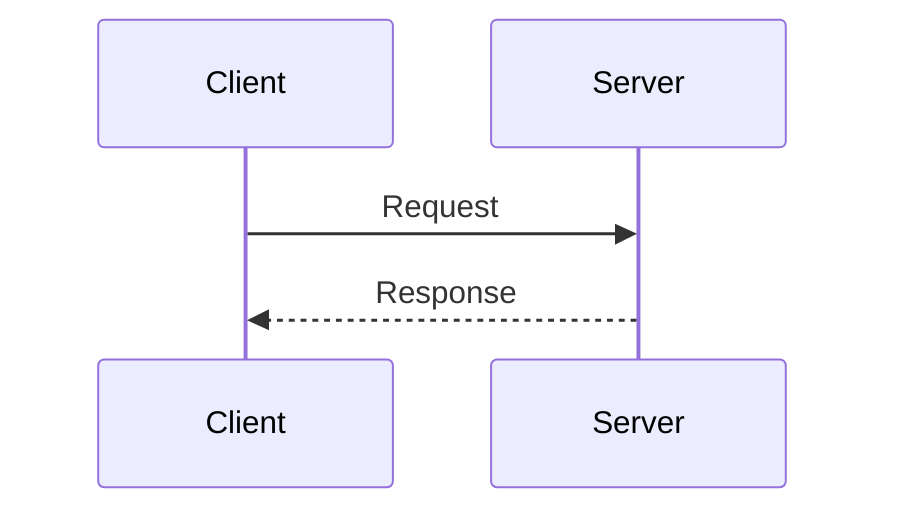

Generate the right visual for the content. Use this decision tree in order:

```
Does it show numeric data with 2+ values to compare?
  YES → Python chart via generate_graph.py (saved as PNG)

Does it show a concept, architecture, system design, or high-level flow?
  YES → Excalidraw (preferred: visually appealing, hand-drawn style)
        Save as output/<section>-visuals/<name>.excalidraw

Does it show a precise sequence, protocol, or state machine where
  exact step ordering and arrow labels matter?
  YES → Mermaid diagram (sequenceDiagram or stateDiagram-v2)

Is it a complex scene, person, or photorealistic illustration?
  YES → AI image placeholder
```

**Default to Excalidraw for architecture and concept diagrams.**
Only use Mermaid when the diagram type genuinely requires it (sequence, state, timeline, pie).

---

## Excalidraw (Preferred for Concept and Architecture Diagrams)

Create a `.excalidraw` file. Every element needs all required fields:

```json
{
  "type": "excalidraw",
  "version": 2,
  "source": "https://excalidraw.com",
  "elements": [
    {
      "id": "box1",
      "type": "rectangle",
      "x": 100, "y": 80,
      "width": 180, "height": 60,
      "angle": 0,
      "strokeColor": "#1e1e1e",
      "backgroundColor": "#a5d8ff",
      "fillStyle": "solid",
      "strokeWidth": 2,
      "roughness": 1,
      "opacity": 100,
      "version": 1,
      "versionNonce": 101,
      "seed": 11
    },
    {
      "id": "lbl1",
      "type": "text",
      "x": 150, "y": 100,
      "width": 80, "height": 20,
      "angle": 0,
      "strokeColor": "#1e1e1e",
      "backgroundColor": "transparent",
      "fillStyle": "solid",
      "strokeWidth": 1,
      "roughness": 1,
      "opacity": 100,
      "version": 1,
      "versionNonce": 102,
      "seed": 12,
      "text": "Component",
      "fontSize": 16,
      "fontFamily": 1,
      "textAlign": "center",
      "verticalAlign": "middle"
    },
    {
      "id": "arr1",
      "type": "arrow",
      "x": 280, "y": 110,
      "width": 100, "height": 0,
      "angle": 0,
      "strokeColor": "#1e1e1e",
      "backgroundColor": "transparent",
      "fillStyle": "solid",
      "strokeWidth": 2,
      "roughness": 1,
      "opacity": 100,
      "version": 1,
      "versionNonce": 103,
      "seed": 13,
      "points": [[0, 0], [100, 0]],
      "startArrowhead": null,
      "endArrowhead": "arrow"
    }
  ],
  "appState": { "gridSize": null, "viewBackgroundColor": "#ffffff" }
}
```

**Element types:** `rectangle`, `ellipse`, `diamond`, `arrow`, `line`, `text`, `freedraw`.

**Required fields per element:** `id`, `type`, `x`, `y`, `width`, `height`, `strokeColor`, `fillStyle`, `opacity`, `version`, `versionNonce`, `seed`.

**Arrow elements** also need: `points` (array of [x,y] pairs), `startArrowhead`, `endArrowhead`.

**Text elements** also need: `text`, `fontSize`, `fontFamily`, `textAlign`, `verticalAlign`.

All IDs must be unique strings. Use descriptive IDs: `"input-box"`, `"phase1-arrow"`.

---

## Mermaid Diagrams (Use Only When Necessary)

### CRITICAL SYNTAX RULES — Always follow these or the diagram will not render:

1. **Quote any label with parentheses:** `A["text (with parens)"]` not `A[text (with parens)]`
2. **Never use reserved words as node IDs:** avoid `end`, `subgraph`, `graph`, `flowchart`, `style`, `direction` as node names. Use `endNode`, `finalStep`, etc.
3. **Quote edge labels with special characters:** `-->|"label, (complex)"|` not `-->|label, (complex)|`
4. **No non-ASCII characters** in any labels. English only.
5. **Avoid classDef/class styling** — causes rendering failures in many viewers.
6. **One diagram type per block** — do not mix `graph TD` and `sequenceDiagram` in the same block.

Available types:

- `sequenceDiagram` — interactions, API calls, protocol steps
- `stateDiagram-v2` — state machines, lifecycle
- `pie` — proportions (titles only, no complex labels)
- `timeline` — historical progression, roadmaps
- `graph TD` / `graph LR` — flowcharts (use Excalidraw for concept maps instead)



---

## Python Charts (Plotly / Seaborn)

Activate the venv, then run:

```bash
source venv/bin/activate && python3 .pi/skills/create-visualization/generate_graph.py \
  --type <chart-type> \
  --title "<title>" \
  --data-file <path-to-json> \
  --output <output-path.png>
```

For small datasets, pass inline with `--data '<json>'` instead of `--data-file`.

### Chart types and their data formats

**bar** — single series:
```json
[{"label": "Method A", "value": 82.3}, {"label": "Method B", "value": 60.1}]
```

**grouped_bar** — multi-series comparison (best for benchmark tables):
```json
[
  {"label": "Benchmark1", "SkillOpt": 82, "Baseline": 60, "Competitor": 70},
  {"label": "Benchmark2", "SkillOpt": 91, "Baseline": 75, "Competitor": 80}
]
```

**line** — trend over time:
```json
[{"label": "Epoch 1", "value": 50}, {"label": "Epoch 2", "value": 65}]
```

**scatter** — two numeric dimensions:
```json
[{"x": 1.2, "y": 3.4, "label": "Point A"}, {"x": 2.5, "y": 4.1, "label": "Point B"}]
```

**pie** — proportions:
```json
[{"label": "Category A", "value": 40}, {"label": "Category B", "value": 60}]
```

**heatmap** — matrix data:
```json
[{"x": "ColA", "y": "Row1", "value": 0.9}, {"x": "ColB", "y": "Row1", "value": 0.4}]
```

**histogram**, **box** — use `value` field per data point.

Write large JSON datasets to a file first, then pass `--data-file path/to/data.json`.

---

## AI Image Placeholder

For complex illustrations, scenes, or photorealistic images:

```markdown
<!-- AI-IMAGE: [Detailed prompt. Include style, composition, colors, what to show.
Example: "Isometric diagram of an AI training loop. A central document labeled SKILL
connects to three surrounding boxes: Optimizer Model, Rollout Traces, and Validation Gate.
Clean, technical illustration. Blue and white color scheme. No text overlays."] -->
```

---

## Output

Save files to the appropriate directory and reference them in the article:
- Teaching: `output/teaching-visuals/`
- SubStack: `output/substack-visuals/`
- LinkedIn: `output/linkedin-visuals/`

Paths in markdown must be relative to `output/`:
```markdown


```
