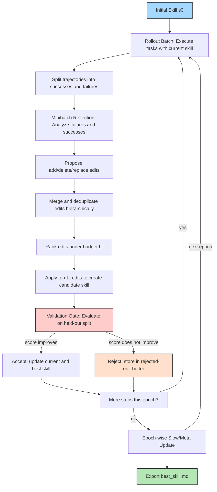
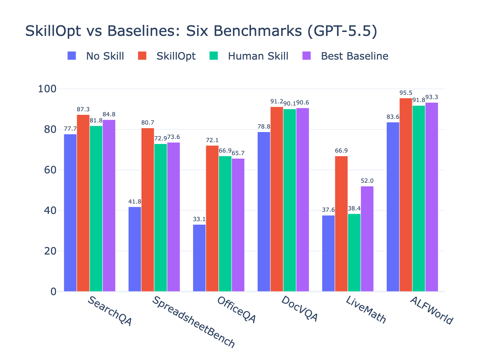

# SkillOpt: Executive Strategy for Self-Evolving Agent Skills
### How a single document, optimized like neural weights, turns GPT-5.5 from a spreadsheet hack into a spreadsheet expert, and what breaks when you remove one piece.

SpreadsheetBench is a graveyard of clever prompts. GPT-5.5 with no instruction scores 41.8%. A human expert writes a careful skill: 72.9%. An LLM writes its own prompt in one shot: 43.2%. TextGrad, the gradient-descent-in-language approach? 41.1%. The best non-SkillOpt baseline scratches 73.6%.

SkillOpt hits 80.7. With a text file under 2,000 tokens.

This is not a better prompt. It is a different philosophy. Treat the skill document as trainable state, apply deep-learning-style controls: bounded edits, held-out validation, rejected-edit buffers, epoch-wise slow updates. The same frozen model jumps 38.9 points on average across six benchmarks. Then hand that skill to a different model or a different execution harness, and it keeps working.

The question is not whether the approach works. The question is which part of the machine makes it work, and what happens when you remove it.

<!-- AI-IMAGE: [Split-screen illustration. Left side shows a frustrated developer tweaking a system prompt with no improvement arrows going in circles. Right side shows a clean technical pipeline with a document labeled "SKILL" in the center, arrows flowing through "Rollout", "Reflect", "Gate", and "Update" modules arranged in a clockwise loop. Blue and gray color scheme. Technical diagram style with no text overlays beyond module labels.] -->

## The Problem With Prompt Engineering

The dominant approach to improving agents is prompt engineering. You observe a failure, you add a rule, you test it. If it helps, keep it. If it hurts, revert. Do this enough times and you might converge on something useful.

This is stochastic gradient descent without a learning rate. Every edit is unbounded. Every new rule can overwrite an old one. There is no validation split. You test on the same example that failed, which guarantees overfitting. There is no momentum, no decay schedule, no principled way to know when to stop.

The paper calls this "uncontrolled self-revision." It is the default. And it explains why one-shot LLM-written skills (43.2% on SpreadsheetBench) barely outperform having no skill at all (41.8%). An LLM prompted to write a skill on its first try produces a plausible document that does not fix anything because it has never seen the actual failure modes.

SkillOpt replaces this ad-hoc loop with seven explicit design choices, each mimicking a piece of the deep learning training stack. Every single one of them earns its keep in the ablation data.

## The Loop: Seven Components That Train a Text File

The architecture separates two roles. A frozen **target model** executes tasks using a current skill document. A separate **optimizer model** reads the resulting trajectories and proposes edits. The optimizer never runs at deployment. The deployed artifact is the skill file itself.

Here is the complete optimization loop:

The loop runs for a few epochs. Each epoch comprises multiple steps. Each step processes a rollout batch, proposes edits, gates them, and either accepts or rejects. At epoch boundaries, a slow/meta update writes longitudinal guidance that step-level edits cannot touch.

The full sequence matters. But three components do the heaviest lifting.

### 1. Bounded Textual Learning Rate

In deep learning, the learning rate prevents weights from jumping too far in one gradient step. SkillOpt's analogue is **Lt**, the maximum number of atomic edits allowed per optimization step.

Unbounded rewriting is the learning rate set to infinity. The optimizer erases useful rules, introduces contradictions, and overfits to the latest failure. With Lt=4 (the default), the skill changes incrementally. Each step fixes at most four atomic things. The cosine schedule starts at Lt=4 and decays to Lt=2, so the skill converges instead of oscillating.

> "Unbounded rewriting is like setting the learning rate to infinity. The optimizer might erase a useful rule, introduce contradictory instructions, or overfit to a single failure."

The ablation is clear. Removing the learning rate constraint drops SpreadsheetBench from 77.5 to 75.7 and LiveMath from 61.3 to 57.3. The dynamic variant, where the optimizer chooses its own budget, also underperforms the fixed default. The optimizer model cannot self-regulate. It needs the guardrail.

### 2. The Validation Gate and Rejected-Edit Buffer

Every candidate skill must prove itself on a held-out selection split before becoming the new current skill. The gate is intentionally strict: a tie is a rejection.

This prevents plausible-sounding edits from accumulating. The optimizer might propose a rule that reads well but breaks something. The gate catches it. And the rejected-edit buffer turns that failure into training signal. When the optimizer processes later minibatches, it sees what was tried, why it failed, and what score drop it caused.

The buffer is not optional. Removing it drops SpreadsheetBench from 77.5 to 72.9 (-4.6 points) and LiveMath from 61.3 to 58.9 (-2.4 points). The effect is largest on procedural benchmarks where repeated mistakes compound.

### 3. Epoch-Wise Slow/Meta Update

Step-level edits are fast and local. They learn from the current rollout batch. The slow/meta update learns from adjacent epochs. It compares the same training items under the previous epoch's skill and the current epoch's skill, then categorizes outcomes into improvements, regressions, persistent failures, and stable successes.

The optimizer writes this longitudinal guidance into a protected field delimited by `<!-- SLOW_UPDATE_START -->` and `<!-- SLOW_UPDATE_END -->` markers. Step-level edits cannot touch this field. Only the epoch-boundary process may overwrite it.

This is the most damaging single ablation in the paper. Removing both the meta skill and the slow update drops SpreadsheetBench from 77.5 to 55.0, a 22.5-point collapse. Without the slow update, step-level edits overwrite durable procedural lessons. The protected field is the mechanism that keeps fast local changes from destroying long-horizon knowledge.

## The Evidence: 52 Cells, Not One Loss

The paper evaluates across 52 (model, benchmark, harness) combinations. SkillOpt is the best or tied-best method on every single cell. On GPT-5.5 direct chat, the six-benchmark average improves by +23.5 points over no skill and beats the strongest per-cell baseline by +5.4 points on average.

The breakdown by capability type tells a more interesting story. On **factual QA** benchmarks like SearchQA and DocVQA, the gap between SkillOpt and a strong human-written skill is narrow, just a few points. On **procedural reasoning** benchmarks like SpreadsheetBench and LiveMath, the gap is enormous. LiveMath jumps from 37.6 (no skill) to 66.9 (SkillOpt). That is not prompt engineering. That is the optimizer discovering procedural rules that humans could not articulate and the model could not infer from a static instruction.

The harness results confirm the pattern is not an artifact of direct chat. Inside the Codex harness, SkillOpt on SpreadsheetBench reaches 85.0, the highest single score in the paper. Inside Claude Code, it reaches 80.4. Both dramatically exceed the EvoSkill baseline (67.5 and 75.0, respectively).

## What the Learned Skills Actually Say

The final skills are short documents, 379 to 1,995 tokens, assembled from only 1 to 4 accepted edits. They contain no memorized examples, no few-shot demonstrations. They contain procedural rules.

One representative rule from the SpreadsheetBench skill: "Inspect workbook structure and formulas, then write evaluated static values across the full requested target range instead of relying on Excel recalculation."

This is not something a human prompt engineer would think to write. It is not obvious from reading the benchmark documentation. It emerged from watching the agent fail. The optimizer observed that GPT-5.5 was writing formulas into cells and relying on the spreadsheet engine to calculate them, but the grader reads cell values after the fact, so the formula was never evaluated. The fix was to compute static values in Python and write those.

That is the kind of insight that only a systematic optimization loop produces. It is specific, procedural, and not generalizable to other benchmarks, which is exactly what you want from a specialized skill.

## The Counter-Argument You Are Thinking Of

This adds a second LLM call to every optimization step. The training cost is significant. Table 8 in the paper shows between 20.8 million and 213.8 million tokens consumed per benchmark. Running the optimizer repeatedly is expensive.

This objection is correct and irrelevant. The cost is paid once during offline training. The deployed artifact adds zero inference-time model calls and requires no weight updates. It is a text file. You ship it the same way you ship a system prompt. The comparison that matters is not training cost versus no training cost. It is the cost of this training versus the cost of paying a human expert to iterate on the same problem for weeks. SkillOpt converges in 1 to 4 accepted edits across a few epochs. That is faster than any human debug cycle.

The harder question is whether the same method works for open-ended tasks where scoring is subjective. SpreadsheetBench has a clear right answer. SearchQA has a retrieval target. What happens when you optimize a skill for "write an engaging blog post"? The paper does not answer this, and the validation gate breaks down without a deterministic score. That is a real limitation.

## What Comes Next

The strongest result in the paper is not the headline numbers. It is the cross-harness transfer. A SpreadsheetBench skill trained inside the Codex harness transfers to Claude Code with an absolute gain of +59.7 over the Claude Code baseline, slightly exceeding the in-domain Claude Code SkillOpt score of 80.4. The symmetric transfer adds +43.6.

These are the largest transfer gains in the paper. They suggest the learned rules, structure-first inspection, formula verification, static value materialization, are harness-independent. The skill learned a general procedure for spreadsheet tasks, not a hack for a specific execution environment.

This changes the economics of agent optimization. You train once in your most convenient harness. You deploy everywhere. The skill document becomes the portable artifact: the weights of the agent, in text form, no GPUs required.

## References

[SkillOpt White Paper](https://arxiv.org/search/?searchtype=all&query=SkillOpt+agent+skills)

[ReAct White Paper](https://arxiv.org/abs/2210.03629)

[DSPy White Paper](https://arxiv.org/abs/2310.03714)

[Trace2Skill White Paper](https://arxiv.org/abs/2603.25158)

[EvoSkill White Paper](https://arxiv.org/abs/2603.02766)

[GEPA White Paper](https://arxiv.org/abs/2507.19457)

[Omni-MATH White Paper](https://arxiv.org/abs/2410.07985)
