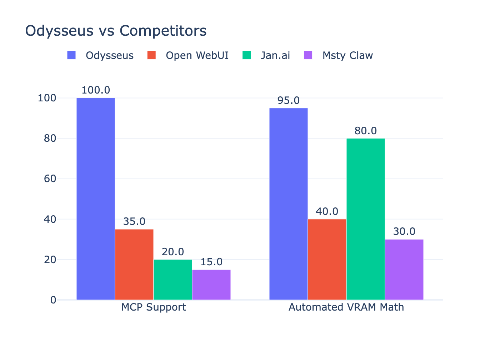

The 30% decline in user trust following recent data breach settlements marks a real turning point for the AI industry.

Trust is lacking. Enterprises demand architectural guarantees instead of mere legal contracts. Cloud AI solutions fail this mandate by prioritizing outgoing data transmission over local ownership. Relying on external APIs creates an inherent trust deficit that most organizations can no longer tolerate in their workflows.

Odysseus uses a unique operational loop where local LLMs generate structured signals instead of documentation text. These triggers allow a backend router to execute bash scripts or web scrapers locally before feeding raw results back into context without any data leaving your machine's perimeter. Automated VRAM math and MCP standards eliminate external friction points. Friction is gone.

Stop building complex cloud dependencies for research agents today. Move your orchestration layer onto an isolated, local system that treats privacy as a fundamental default constraint to ensure absolute data sovereignty from the very first prompt execution. It is simpler locally.

How will you secure your agentic architecture?

#AI #AgentSystems #LLM