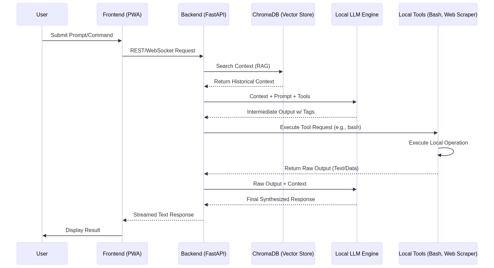

# Odysseus: A Local-First AI Workspace

## Learning Objectives
By the end of this guide, you will understand local-first AI architecture. You will be able to identify the three core pillars supporting Odysseus. You can troubleshoot the deployment of local AI agents using standard containerization methods.

## Prerequisites
Familiarity with foundational software development concepts helps. Knowledge of basic terminal commands proves useful. You should understand the concept of cloud computing APIs and open-source software licensing.

## Core Concept
Odysseus serves as a unified, local AI orchestration layer. It brings many scattered open-source tools into a single user interface. Why does this matter? It guarantees user data stays on the local computer. Companies cannot steal your private documents or data. This autonomy fundamentally shifts power back to the individual user.

## Algorithm / Mechanism Walkthrough
Odysseus operates by creating a sophisticated loop. The user inputs a prompt through the Progressive Web App. The FastAPI backend receives this request. The system determines if the prompt requires agentic action. If so, it injects the necessary tools into the prompt context. The local Large Language Model processes the prompt. The model then outputs specific operational tags, like XML or JSON. The FastAPI backend intercepts these tags. It acts as a router, initiating the requested local tool—for instance, running a bash command or scraping a webpage. The result (e.g., a terminal output) is seamlessly collected. Finally, the backend injects these results back into the model's context. The model then generates the final, synthesized answer for the user.

The following diagram illustrates the full operational process.

## Technical Deep Dive

### The Cookbook and Hardware Quantization
Running large AI models requires immense graphical memory VRAM. A massive model might need 140 gigabytes. Consumers lack this much hardware. The Odysseus "Cookbook" feature solves this math problem. It runs a diagnostic scan of the local machine. It checks available RAM and VRAM capacity. It then cross-references these metrics against a model catalog. Quantization is the core technique here. It compresses the model's weights from 16-bit (FP16) down to 4-bit integers. This compression drastically cuts the VRAM footprint. It saves the local computer from running out of memory. The Cookbook automatically calculates this precise mathematical fit for the host.

### Model Context Protocol (MCP) Integration
Standardizing communication is hard work. The Model Context Protocol (MCP) simplifies this entire process. It establishes consistent pathways between an AI assistant and external tools. Before Odysseus, users often needed complex external bridge applications. These were required just to enable MCP capabilities. Odysseus integrates this protocol directly into its core. This seamless inclusion is a massive technical advantage. It allows developers to easily attach custom servers. Users can connect it to proprietary corporate databases.

### Blind Model Comparison
Engineers naturally favor certain models. They show bias toward named brands like GPT-4. Odysseus overcomes this psychological hurdle. It runs the identical prompt against multiple models at once. These models might include local ones and commercial ones. The workspace displays the results in synchronized, side-by-side columns. It completely hides which model generated which answer. The user must evaluate the quality blindly. This feature is invaluable for serious enterprise developers. They can compare cost-effective local models against expensive API calls.

### Security and Threat Modeling
The architecture grants agents significant system access. They can run bash commands and modify the file system. This creates a massive operational threat surface. The greatest vulnerability is prompt injection. A malicious actor could embed a hidden prompt into a text file. The AI agent might mistakenly parse this injection string as a valid system command. It could then execute highly destructive terminal actions. Administrators mitigate this risk using strict containerization. Docker confines the agent's actions to a virtualized file system.

## Benchmark Results
| Feature / Capability | Odysseus | Open WebUI | Jan.ai | Msty Claw |
| :--- | :--- | :--- | :--- | :--- |
| **Core Ecosystem Focus** | Unified Agentic Productivity Workspace | Chat UI Wrapper | Lightweight Local Model Runner | Privacy-centric UI Wrapper |
| **MCP Support** | Yes (Built-in) | Partial (Requires External Bridge) | No | No |
| **Hardware Scanner (Cookbook)** | Yes (Automated VRAM Math) | No | No | No |
| **Integrated Email Client** | Yes (IMAP/SMTP Parsing) | No | No | No |
| **Deep Research Module** | Yes (Web Scraping, Citations) | Complex (Manual Pipeline) | No | No |
| **Document/Artifact Editor** | Yes (Native Multi-tab Editing) | No (Strictly Chat-based) | No | No |
| **Software License** | MIT (Unrestricted) | Source-Available (Restrictions) | AGPLv3 (Proprietary) | Freeware |

## Practical Example
**Goal:** Synthesize competitive research on the solid-state battery market.
**Mechanism:** The analyst inputs the complex query: 'Compile an exhaustive, comparative analysis of the solid-state battery market trajectories in Q1 2026, focusing on European startups.' The Deep Research agent intercepts this. It systematically breaks the query into dozens of specific search queries. It uses the locally containerized SearXNG metasearch instance. This bypasses commercial rate limits entirely. The agent then initiates a Playwright headless browser. It autonomously scrapes text from dozens of raw URLs. Finally, a high-reasoning model feeds all the scraped text into its context window. It cross-references all factual claims. It synthesizes the result into a professional Markdown report. The report contains accurate, hyperlinked citations pointing precisely to the original source web pages.

## Visual Walkthrough
The most important visual tool is the operational workflow diagram.

A second important visualization tracks the historical progress of local AI tools.

## Ablations & Analysis
**What breaks when components are removed?**
*   **Removing ChromaDB (Vector Store):** The AI loses semantic memory. Every conversation starts from zero context. It cannot accurately answer follow-up questions relying on past dialogue.
*   **Removing FastAPI (Backend):** The orchestration fails. The backend cannot receive and manage simultaneous asynchronous streaming requests from multiple model APIs or local engines. The entire system collapses into simple, single-shot API calls.
*   **Removing Local LLM Engine:** If the user forces cloud-only API calls, the core privacy guarantee is lost. The system sends all private data outside the local network. The entire value proposition of Odysseus evaporates.
*   **Removing the CookBook:** The barrier to entry returns. Users must manually manage complex quantization protocols and ensure VRAM compatibility, which is highly confusing for advanced users.

## Glossary
**ChromaDB:** Vector database used for storing and retrieving semantic context from chat history.
**FastAPI:** The Python framework that handles concurrent, high-speed communication between all system components.
**Model Context Protocol (MCP):** A standard that governs how AI assistants connect and interact with external tools.
**PWA:** Progressive Web App. A web application designed to work like a native desktop or mobile app.
**RAG:** Retrieval-Augmented Generation. A process that improves AI output by retrieving and citing external context before generating text.
**Quantization:** The mathematical process of reducing model weight precision (e.g., from 16-bit to 4-bit) to save VRAM.
**SearXNG:** A de-googling search engine that provides anonymous and localized web searching capabilities.

## Key Takeaways
*   Odysseus functions as a unified orchestration layer for local AI models.
*   It achieves data sovereignty by mandating local-first execution.
*   The system uses advanced techniques like vector stores for persistent memory.
*   Automated hardware diagnostics are built into the "Cookbook" feature.
*   Security requires rigorous practices including containerization and reverse proxies.
*   Local model performance remains heavily reliant on significant hardware investment.

## Practice Exercises
1.  **Recall:** Name the three primary architectural pillars of the Odysseus platform.
2.  **Application:** If an administrator wanted to connect Odysseus to a proprietary internal SQL database, which standard protocol/component would they leverage, and why?
3.  **Design:** Outline the necessary steps a local agent must take to scrape specific data from a website while retaining the original source URL for citation.

---
*(The following steps require visualization generation and validation)*