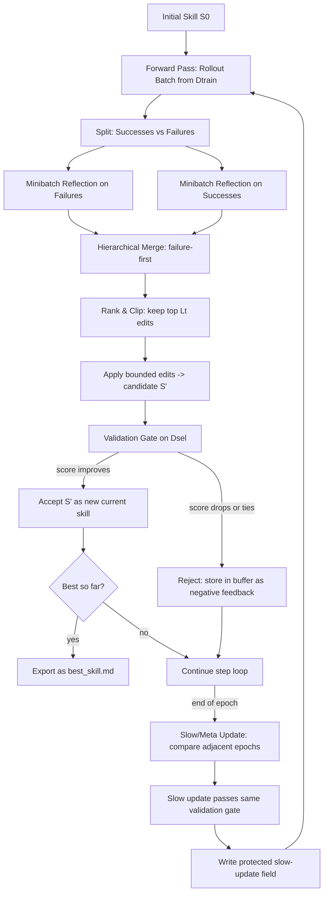
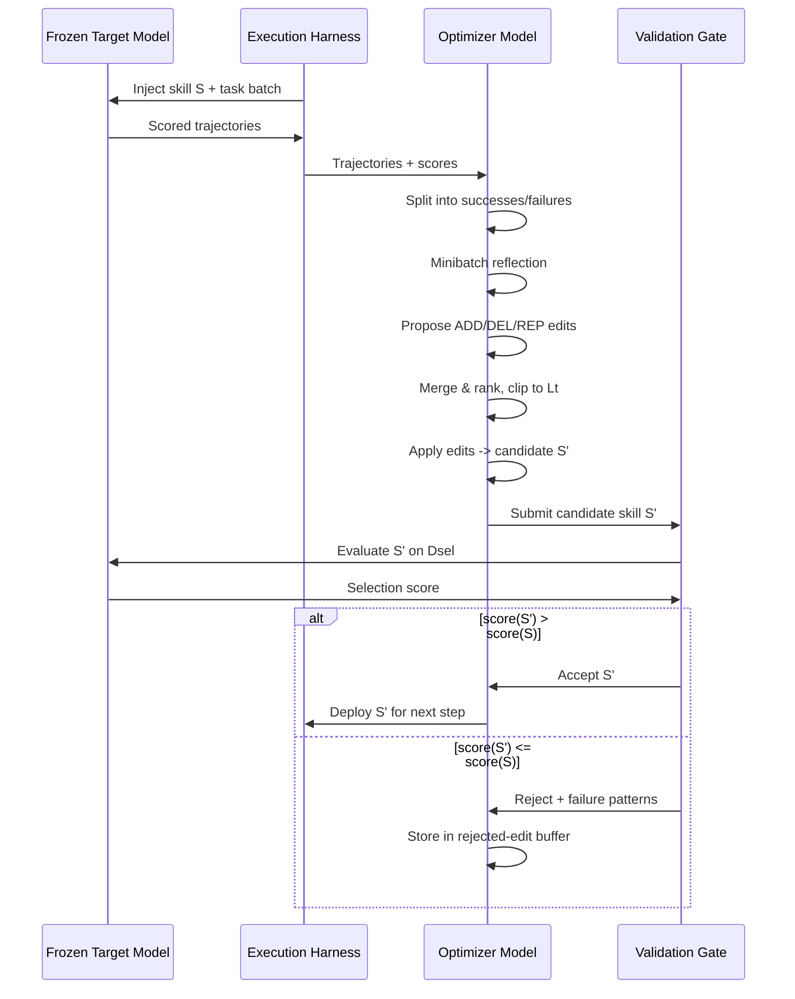
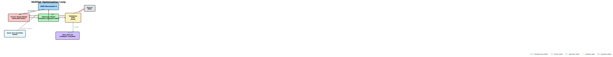
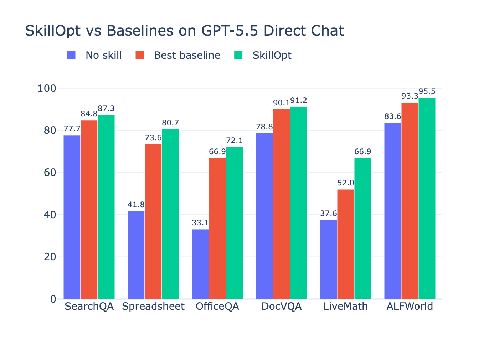
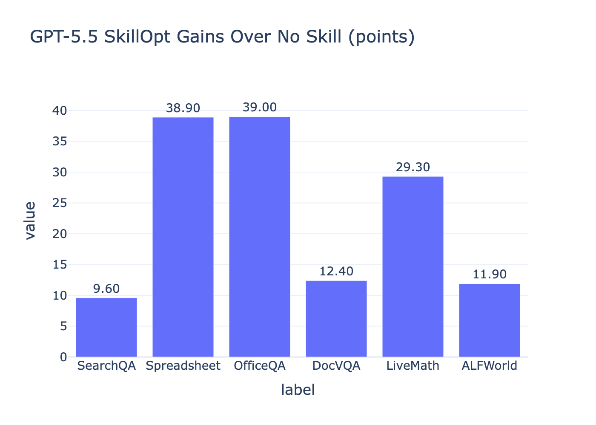
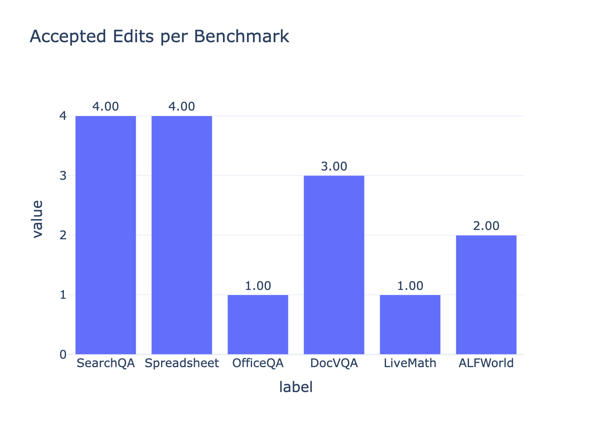

# SkillOpt: A Complete Teaching Guide

## Learning Objectives

By the end of this guide, you will be able to:

1. Explain why agent skills need a controlled optimization procedure instead of ad hoc rewriting.
2. Describe each component of the SkillOpt loop: rollout batches, minibatch reflection, bounded edits, validation gating, rejected-edit buffers, and epoch-wise slow/meta updates.
3. Interpret benchmark results and ablation studies to identify which design choices drive the largest gains.
4. Apply the SkillOpt paradigm to design a bounded text-space optimizer for a new agent domain.

## Prerequisites

You should be comfortable with standard supervised learning concepts: training/validation/test splits, learning rates, batch sizes, and gradient descent. You do not need a deep learning background, but you should know what an LLM agent is and how it uses tools, prompts, and system instructions. Familiarity with prompt engineering and reflection-based self-improvement (e.g., Reflexion, Self-Refine) is helpful but not required.

## Core Concept

An agent skill is a natural-language document that packages procedures, domain heuristics, tool policies, output constraints, and failure-mode handling for a frozen LLM agent. Instead of changing model weights, we change this text document — and we treat that change as a trainable optimization problem.

Why does this matter? A frontier model might achieve 41.8% accuracy on SpreadsheetBench with no adaptation. A human-written skill lifts it to 72.9%. A controlled, bounded skill optimizer pushes it to 80.7%. That 39-point gap between zero-shot and optimized is the difference between a model that cannot reliably manipulate spreadsheets and one that can. Without optimization, agent adaptation relies on brittle one-shot prompts or uncontrolled self-revision that often makes things worse.

SkillOpt is the first systematic, controllable text-space optimizer for agent skills. It treats the skill document as external state, an additional frontier model as the optimizer, and uses deep-learning-style controls — rollout batches, reflection minibatches, bounded edit budgets, validation gates, rejected-edit buffers, and epoch-wise slow/meta updates — to produce a compact, reusable skill artifact that transfers across models, harnesses, and benchmarks.

## Algorithm / Mechanism Walkthrough

SkillOpt operates as a closed loop. The target model that executes tasks stays frozen. An optimizer model reads execution trajectories, proposes edits to the skill document, and a validation gate decides which edits survive.

### The Optimization Loop

**Step 1: Forward Pass (Rollout).** The frozen target model runs a batch of tasks from the training split using the current skill. The harness records task metadata, messages, tool calls, observations, final answers, and verifier feedback. This batch is the evidence unit for one update step.

**Step 2: Separating Successes and Failures.** The optimizer model partitions the rollout trajectories into successes and failures. This distinction matters because failures expose missing or incorrect rules, while successes encode behaviors worth preserving.

**Step 3: Minibatch Reflection.** The optimizer processes each group in reflection minibatches (default size: 8). Single trajectories often produce anecdotal fixes; minibatches expose recurring procedural errors — the agent consistently searches the wrong source, writes answers in the wrong format, or fails to verify a tool result. Each reflection returns structured add/delete/replace edits.

**Step 4: Hierarchical Merge.** Edits from failure minibatches are merged first, then success minibatches, then a final failure-prioritized merge combines both. This step filters duplicates, resolves contradictions, and discards example-specific suggestions.

**Step 5: Bounded Application (Textual Learning Rate).** The merged edit pool is ranked by expected utility and clipped to the top Lt edits (default Lt=4 with cosine decay). This bounded update is the key difference from ad hoc rewriting. Unbounded rewrites can erase useful rules or overfit to a single failure; bounded updates preserve continuity.

**Step 6: Validation Gate.** Every candidate skill is evaluated on a held-out selection split. It is accepted only if it strictly improves the current selection score. Ties are rejected. This gate turns reflection into propose-and-test optimization rather than unconditional self-editing.

**Step 7: Rejected-Edit Buffer.** Rejected updates are not discarded. The optimizer records failure patterns and the edits that were tried. Later reflection calls in the same epoch receive this buffer as negative feedback, helping the optimizer avoid repeating failed edits.

**Step 8: Epoch-Wise Slow/Meta Update.** At the end of each epoch, SkillOpt compares the same training items under the previous and current skills. It groups outcomes into improvements, regressions, persistent failures, and stable successes. The optimizer writes longitudinal guidance into a protected slow-update field. A separate optimizer-side meta skill summarizes which edit patterns helped and which failed, prepended only to future optimizer prompts.

### Mermaid Flowchart of the Full Process

## Technical Deep Dive

### 1. Bounded Text Updates as a Learning Rate Analogue

The edit budget Lt is the most important design choice. It plays the same role as a learning rate in gradient descent: it controls how far one skill version can move from the previous one.

In standard SGD, a high learning rate can overshoot the optimum. In SkillOpt, a high edit budget (Lt=16 or unconstrained) lets the optimizer make large semantic jumps, potentially erasing useful rules or introducing incompatible instructions. A low budget (Lt=1) may be too conservative to fix enough failures in one step.

The paper evaluates Lt values from 1 to 16. On SpreadsheetBench, Lt=4 achieves 78.2, Lt=8 achieves 73.6, and Lt=16 achieves 78.2 again — the score is stable within a range, but unconstrained rewriting (the "without lr" ablation) drops to 75.7. The key insight: any moderate, bounded budget beats unbounded rewriting.

The default uses a cosine schedule starting at Lt=4 and decaying to a floor of Lt=2. This allows larger changes early in training when the skill is far from optimal, then smaller refinements later.

**Edge case:** When the training pool is very small (e.g., LiveMathematicianBench with only 35 training items), the optimizer must be more conservative. The paper adjusts batch sizes per benchmark but keeps the same bounded-edit machinery.

### 2. The Validation Gate: Why Strict Acceptance Matters

The validation gate is intentionally strict: a candidate skill is accepted only when its selection-split score is **strictly greater** than the current score. Ties are rejected.

This conservative criterion prevents silent drift. If the gate accepted ties, a candidate that neither helps nor hurts could gradually replace useful rules. Over multiple epochs, the skill could degrade without ever triggering a clear rejection.

The gate also makes rejected edits informative. When an edit fails, the optimizer knows it produced a score that was equal to or worse than the current skill. This negative feedback is stored in the rejected-edit buffer and used in later reflection calls.

**Failure mode:** A candidate skill could improve on the selection split but generalize poorly to the test split. Figure 3 in the paper shows that validation checkpoints track test-set performance across epochs, confirming the gate tends to select skills that generalize. But if the selection split is too small or differs in distribution from the test split, the gate could overfit.

### 3. Rejected-Edit Buffer as Negative Feedback

The following sequence diagram shows the interaction between all four components during one optimization step.

The rejected-edit buffer converts failed After each rejection, the optimizer records:
- The edits that were tried.
- The observed failure patterns from the rollout trajectories.
- The score drop (or tie) they caused.

Later reflection calls in the same epoch receive this buffer. The optimizer learns what not to repeat. This is analogous to momentum or gradient history in deep learning — but applied to text-space edits rather than weight vectors.

The ablation study quantifies the buffer's value: removing it drops SpreadsheetBench from 77.5 to 72.9 (-4.6 points) and LiveMath from 61.3 to 58.9 (-2.4 points). The effect is largest on procedural benchmarks where repeated mistakes are most costly.

### 4. Epoch-Wise Slow/Meta Update

Fast step-level edits learn from the current rollout batch. The slow/meta update learns from adjacent epochs. At the end of each epoch, the optimizer compares the same 20 training tasks under the previous and current skills, then categorizes outcomes:

- **Improvements:** Tasks that were wrong and are now right.
- **Regressions:** Tasks that were right and are now wrong.
- **Persistent failures:** Tasks that were wrong and remain wrong.
- **Stable successes:** Tasks that were right and remain right.

The optimizer writes longitudinal guidance into a protected slow-update field delimited by `<!-- SLOW_UPDATE_START -->` and `<!-- SLOW_UPDATE_END -->` markers. Step-level edits cannot touch this region. Only the epoch-boundary slow-update process may rewrite it, and the rewritten skill still passes through the same validation gate.

A separate **optimizer-side meta skill** (never shipped to the target model) summarizes which edit patterns helped, which were rejected, and which failures persisted. This meta guidance is prepended to future optimizer prompts for reflection, merging, and ranking.

The ablation is stark: removing both meta skill and slow update drops SpreadsheetBench from 77.5 to 55.0 — a 22.5-point degradation, the largest in the ablation suite.

### 5. Harness-Agnostic Deployment

SkillOpt works through a lightweight adapter interface. An adapter constructs train/evaluation batches, injects the current skill into the agent context, runs the native harness, and returns scored trajectories. The same optimizer therefore works for:

- **Direct chat:** Simple QA with skill prepended to system prompt.
- **Codex harness:** The skill is rendered to a per-task SKILL.md alongside task files; a compact execution trace is returned.
- **Claude Code harness:** Mirrors the same workspace contract through the Claude CLI.

All three modes consume the same `best_skill.md` file format. This enables cross-harness transfer: a skill trained inside Codex can be deployed inside Claude Code without modification.

## Benchmark Results

### Main Results: GPT-5.5 Direct Chat

| Method | SearchQA | SpreadsheetBench | OfficeQA | DocVQA | LiveMath | ALFWorld |
|--------|----------|-----------------|----------|--------|----------|----------|
| No skill | 77.7 | 41.8 | 33.1 | 78.8 | 37.6 | 83.6 |
| Human skill | 81.8 | 72.9 | 66.9 | 90.1 | 38.4 | 91.8 |
| LLM skill | 80.9 | 43.2 | 51.7 | 89.6 | 40.0 | 93.3 |
| Trace2Skill | 82.4 | 49.6 | 65.7 | 90.6 | 52.0 | 87.3 |
| TextGrad | 81.4 | 41.1 | 42.0 | 87.2 | 49.2 | 82.8 |
| GEPA | 84.8 | 73.6 | 63.9 | 89.1 | 43.2 | 85.8 |
| **SkillOpt** | **87.3** | **80.7** | **72.1** | **91.2** | **66.9** | **95.5** |

### Main Results: GPT-5.4 (All Models, Direct Chat)

| Model | Method | SearchQA | SpreadsheetBench | OfficeQA | DocVQA | LiveMath | ALFWorld |
|-------|--------|----------|-----------------|----------|--------|----------|----------|
| **GPT-5.4** | No skill | 76.9 | 41.4 | 50.0 | 77.6 | 36.8 | 75.4 |
| | SkillOpt | **83.1** | **62.5** | **62.8** | **91.2** | **44.0** | **91.0** |
| **GPT-5.4-mini** | No skill | 75.9 | 36.1 | 22.1 | 71.4 | 14.7 | 73.1 |
| | SkillOpt | **80.2** | **47.5** | **48.8** | **90.9** | **32.8** | **85.8** |
| **GPT-5.4-nano** | No skill | 55.8 | 23.5 | 16.3 | 30.8 | 23.2 | 34.3 |
| | SkillOpt | **74.8** | **42.5** | **50.0** | **80.2** | **27.2** | **69.4** |
| **GPT-5.2** | No skill | 71.9 | 38.2 | 34.9 | 73.1 | 20.8 | 68.7 |
| | SkillOpt | **83.1** | **57.1** | **56.4** | **89.6** | **36.0** | **85.1** |

### Main Results: Smaller Models (Direct Chat)

| Model | Method | SearchQA | SpreadsheetBench | OfficeQA | DocVQA | LiveMath | ALFWorld |
|-------|--------|----------|-----------------|----------|--------|----------|----------|
| **Qwen3.5-4B** | No skill | 68.1 | 9.3 | 14.5 | 86.9 | 22.4 | 30.6 |
| | SkillOpt | **71.2** | **23.9** | **29.7** | **89.0** | **52.0** | **81.3** |
| **Qwen3.6-35B-A3B** | No skill | 72.7 | 38.2 | 45.9 | 87.6 | 31.2 | 59.7 |
| | SkillOpt | **80.3** | **47.5** | **47.1** | **91.4** | **41.6** | **82.1** |

### Harness Results: Codex and Claude Code (GPT-5.5)

| Harness | Method | SearchQA | SpreadsheetBench | OfficeQA | DocVQA | LiveMath |
|---------|--------|----------|-----------------|----------|--------|----------|
| **Codex** | No skill | 81.8 | 27.5 | 38.3 | 87.2 | 35.2 |
| | EvoSkill | 61.4 | 67.5 | 42.4 | 89.3 | 63.2 |
| | SkillOpt | **87.3** | **85.0** | **51.1** | **92.2** | **78.4** |
| **Claude Code** | No skill | 81.9 | 22.1 | 57.6 | 86.6 | 40.8 |
| | EvoSkill | 84.0 | 75.0 | 70.3 | 87.2 | 52.0 |
| | SkillOpt | **85.9** | **80.4** | **71.5** | **90.1** | **56.5** |

### Hyperparameter Analysis (GPT-5.5 / GPT-5.5)

| Setting | SearchQA | SpreadsheetBench | LiveMath |
|---------|----------|-----------------|----------|
| **Training set size** | | | |
| 1 example | 81.0 | 47.5 | 59.1 |
| 20% train | 84.1 | 69.0 | 65.9 |
| 100% train | 84.1 | 78.0 | 70.5 |
| **Learning rate Lt** | | | |
| lr=1 | 85.5 | 77.5 | 62.1 |
| lr=4 (default) | 86.5 | 78.2 | 56.5 |
| lr=8 | 87.0 | 73.6 | 66.9 |
| lr=16 | 86.8 | 78.2 | 65.3 |
| **Learning-rate scheduler** | | | |
| constant | 87.3 | 80.7 | 62.1 |
| cosine (default) | 87.1 | 77.5 | 61.3 |
| linear | 87.2 | 72.9 | 62.9 |

### Component Ablations (GPT-5.5 / GPT-5.5)

| Component | Setting | SearchQA | SpreadsheetBench | LiveMath |
|-----------|---------|----------|-----------------|----------|
| Learning rate | lr=4 (default) | 87.1 | 77.5 | 61.3 |
| | dynamic lr | 85.8 | 71.8 | 54.0 |
| | without lr | 84.6 | 75.7 | 57.3 |
| Rejected buffer | with (default) | 87.1 | 77.5 | 61.3 |
| | without | 85.5 | 72.9 | 58.9 |
| Slow/meta update | full (default) | 87.1 | 77.5 | 61.3 |
| | without meta skill | 85.1 | 75.7 | 58.1 |
| | without both | 86.3 | 55.0 | 59.7 |

### Transfer Results

| Type | Source | Target | Benchmark | Baseline | Transferred |
|------|--------|--------|----------|----------|-------------|
| Cross-model | GPT-5.4 | GPT-5.4-mini | SpreadsheetBench | 36.1 | 45.5 (+9.4) |
| Cross-model | GPT-5.4 | GPT-5.4-nano | SpreadsheetBench | 23.5 | 26.5 (+3.0) |
| Cross-model | GPT-5.4 | GPT-5.4-mini | LiveMath | 14.7 | 19.2 (+4.5) |
| Cross-model | GPT-5.4 | GPT-5.4-nano | LiveMath | 23.2 | 28.8 (+5.6) |
| Cross-harness | Codex | Claude Code | SpreadsheetBench | 22.1 | 81.8 (+59.7) |
| Cross-harness | Claude Code | Codex | SpreadsheetBench | 27.5 | 71.1 (+43.6) |
| Cross-harness | Codex | Claude Code | LiveMath | 40.8 | 42.4 (+1.6) |
| Cross-harness | Claude Code | Codex | LiveMath | 35.2 | 48.0 (+12.8) |
| Cross-benchmark | OlympiadBench | Omni-MATH | GPT-5.4 | 56.6 | 60.3 (+3.7) |

### Cost and Edit Economy

| Benchmark | Initial (tok) | Final (tok) | Accepted Edits | Train Tokens | Cost / pt |
|-----------|-------------|------------|---------------|-------------|-----------|
| SearchQA | 16 | 857 | 4 | 213.8M | 37.9M |
| SpreadsheetBench | 224 | 1,995 | 4 | 21.4M | 0.6M |
| OfficeQA | 145 | 883 | 1 | 20.8M | 1.1M |
| DocVQA | 81 | 959 | 3 | 188.2M | 46.4M |
| LiveMath | 154 | 379 | 1 | 23.2M | 3.6M |
| ALFWorld | 516 | 1,321 | 2 | 59.3M | 15.9M |

## Practical Example

Let us trace SkillOpt on one complete run: optimizing a spreadsheet skill for GPT-5.5 on SpreadsheetBench.

**Starting state.** The initial skill is 224 tokens long. It instructs the agent to use Python spreadsheet libraries and to preserve unrelated workbook content. The no-skill baseline for GPT-5.5 on SpreadsheetBench is 41.8%. The human-written skill reaches 72.9%.

**Epoch 1, Step 1.** The target model runs 40 training tasks with the initial skill. The optimizer identifies several failure modes from the trajectories. The agent often skips inspecting the workbook structure and relies on the preview alone. It sometimes writes formulas where the grader expects static values. It fails to fill complete target ranges, leaving some cells blank.

The optimizer proposes edits and the validation gate accepts a set that adds two rules:
- Inspect the actual workbook structure first (sheets, cells, formulas) before writing any code.
- When the grader reads cell values, compute and write evaluated static values.

The selection score improves from 0 to 40.4.

**Epoch 1, Step 2.** A second rollout batch exposes more failures. The agent still misses boundary rows and sometimes adds extraneous columns. The optimizer proposes and the gate accepts:
- Fill complete target ranges, including currently blank result cells.
- Keep helper computations in Python, not in the workbook.
- Reopen the saved workbook to check boundary rows.

The selection score rises to 78.9.

**Epoch 2, Step 4.** After several more steps (some accepted, some rejected), the optimizer passes the validation gate with a final skill of 1,995 tokens. The selection score reaches its peak.

**Final test evaluation.** The deployed best_skill.md achieves 80.7 on the held-out test split — 38.9 points above no skill, 7.8 points above the human skill baseline, and 4.3 points above GEPA (the strongest non-SkillOpt baseline on this benchmark).

**What the learned skill says.** One representative rule from the final skill: "Inspect workbook structure and formulas, then write evaluated static values across the full requested target range instead of relying on Excel recalculation."

## Visual Walkthrough

### SkillOpt Pipeline Diagram

The full optimization loop connects a frozen target model, an optimizer model, and a validation gate through a bounded edit cycle. The diagram below shows how skill documents flow through the system.

### Benchmark Performance Comparison

SkillOpt vs the strongest per-cell baseline across all six benchmarks on GPT-5.5 direct chat. Procedural benchmarks (SpreadsheetBench, OfficeQA, LiveMath) show the largest gaps.

### Gains Over No-Skill Baseline

Bar chart showing the absolute point gain SkillOpt delivers over the no-skill baseline on each benchmark for GPT-5.5 direct chat.

### Edit Economy

One of the most striking results: SkillOpt achieves large gains from very few accepted edits. OfficeQA's +39.0 point gain comes from a single accepted edit.

### Architecture Diagram (Excalidraw)

### Conceptual Illustration

<!-- AI-IMAGE: [Isometric visualization of the SkillOpt training loop. A glowing central document labeled "SKILL" radiates connections to three surrounding nodes: a robot icon for "Target Model" executing tasks, a brain icon for "Optimizer Model" analyzing trajectories, and a shield icon for "Validation Gate." Data flows clockwise through arrows forming a closed loop. Clean technical illustration with a dark blue background and cyan accent highlights. Minimal text, no overlays.] -->

## Ablations & Analysis

### What Breaks When the Edit Budget Is Removed?

Without a bounded textual learning rate, the optimizer can apply any number of edits per step. SpreadsheetBench drops from 77.5 to 75.7, and LiveMath drops from 61.3 to 57.3. The drop is moderate but consistent across all three benchmarks. Unbounded rewriting allows the skill to overfit to the latest failure patterns while erasing useful prior rules. The dynamic learning rate variant (where the optimizer chooses its own budget) also underperforms the fixed Lt=4 default, suggesting the optimizer model cannot reliably self-regulate its own edit volume.

### What Breaks When the Rejected-Edit Buffer Is Removed?

Removing the buffer drops SpreadsheetBench by 4.6 points (77.5 to 72.9) and LiveMath by 2.4 points (61.3 to 58.9). Without negative feedback from rejected edits, the optimizer repeats the same failed edits across steps. The buffer serves as a short-term memory of what did not work, preventing the loop from cycling through the same bad proposals.

### What Breaks When the Slow/Meta Update Is Removed?

This is the most damaging ablation. Removing only the optimizer-side meta skill drops SpreadsheetBench from 77.5 to 75.7. Removing both the meta skill and the slow update drops SpreadsheetBench to 55.0 — a 22.5-point collapse, the largest in the entire ablation suite.

Without the slow update, step-level edits can overwrite durable procedural lessons. The protected slow-update field is the mechanism that keeps fast local changes from destroying long-horizon knowledge. Without it, different epoch boundaries produce contradictory skill documents, and the optimizer loses the benefit of accumulated experience.

### What Happens with Insufficient Training Data?

When only 1 training example is available, SpreadsheetBench reaches only 47.5 (vs. 78.0 with full data). The optimizer cannot distinguish systematic failures from noise. With 20% of the training data (roughly 44 examples on a typical split), SpreadsheetBench jumps to 69.0, capturing most of the gain. The returns diminish after 40-80% of the data, suggesting the optimizer converges to stable knowledge after seeing enough diverse failure patterns.

### What Happens When the Optimizer Model Is Weaker?

Table 5 tests the frontier optimizer (GPT-5.5) against a target-matched optimizer that shares the target model. The strong optimizer is better on every cell. But the target-matched optimizer still recovers 56-74% of the strong-optimizer gain, confirming that the optimization loop itself contributes substantial value independent of optimizer quality.

### What Happens During Cross-Model Transfer?

A SpreadsheetBench skill trained on GPT-5.4, when deployed on GPT-5.4-mini, produces a +9.4 gain over the no-skill baseline. That is 82% of the in-domain gain (+11.4). The skill encodes workbook procedures that are target-model agnostic. All four cross-model transfer rows are positive.

### What Happens During Cross-Harness Transfer?

A SpreadsheetBench skill trained inside the Codex harness transfers to Claude Code with an absolute gain of +59.7 over the Claude Code baseline — slightly exceeding the in-domain Claude Code SkillOpt score of 80.4. The symmetric transfer (Claude Code to Codex) adds +43.6. These are the largest transfer gains in the paper, and they suggest the learned rules (structure-first inspection, formula verification, static value materialization) are harness-independent.

## Glossary

| Term | Definition |
|------|-----------|
| **Bounded edit budget** | The maximum number of skill edits applied per optimization step, analogous to a learning rate. |
| **Cosine schedule** | A learning-rate decay schedule that starts with larger edits and smoothly decays to smaller refinements. |
| **Epoch-wise slow/meta update** | Longitudinal guidance written at epoch boundaries, comparing adjacent epoch skills and placed in a protected field that step-level edits cannot overwrite. |
| **Harness adapter** | A lightweight interface that connects SkillOpt to different execution environments (direct chat, Codex, Claude Code). |
| **Held-out validation gate** | A strict acceptance criterion: a candidate skill is accepted only when its selection-split score strictly exceeds the current score. |
| **Minibatch reflection** | Processing multiple trajectories together to identify recurring procedural errors rather than single-instance issues. |
| **Optimizer model** | An additional frontier LLM that reads rollout trajectories and proposes structured skill edits during training only. |
| **Optimizer-side meta skill** | A compact summary of which edit patterns helped, which failed, and which failures persisted, used only to guide future optimizer calls. |
| **Protected slow-update field** | A delimited region of the skill document (`<!-- SLOW_UPDATE -->` markers) that only the epoch-boundary process may edit. |
| **Rejected-edit buffer** | Storage for edits that failed the validation gate, used as negative feedback in later reflection calls. |
| **Rollout batch** | A set of training tasks executed by the frozen target model with the current skill to produce trajectory evidence. |
| **Skill** | A natural-language artifact that packages procedures, domain heuristics, tool policies, output constraints, and failure modes for a frozen agent. |
| **Target model** | The frozen LLM whose behavior is adapted through skill optimization; its weights never change. |
| **Text-space optimization** | Treating the skill document as trainable state, with edits analogous to weight updates in deep learning. |

## Key Takeaways

- SkillOpt is the first systematic text-space optimizer for agent skills, treating skill editing as a controlled domain-adaptation process with deep-learning-style controls.
- Across 52 evaluated (model, benchmark, harness) cells, SkillOpt is the best or tied-best method on every single cell, outperforming human-written, one-shot, prompt-optimization, and skill-evolution baselines.
- On GPT-5.5 direct chat, SkillOpt lifts the six-benchmark average by +23.5 points over no skill and beats the strongest per-cell baseline by +5.4 points on average.
- The design relies on bounded edit budgets, minibatch reflection, held-out validation gates, rejected-edit buffers, and epoch-wise slow/meta updates — removing any of these components measurably degrades performance, with the slow/meta update ablation causing a 22.5-point drop on SpreadsheetBench.
- Learned skills are compact (379-1,995 tokens), assembled from only 1-4 accepted edits, and contain procedural rules that generalize rather than memorizing specific examples.
- Optimized skills transfer across model scales (recovering up to 82% of in-domain gain), across execution harnesses (up to +59.7 points), and across related benchmarks (uniformly positive gains).
- The optimization cost is paid once during offline training; the deployed artifact adds zero inference-time model calls and requires no weight updates.

## Practice Exercises

**Exercise 1 (Recall).** List the four atomic edit operations supported by SkillOpt's patch mode. Explain why bounded application of these edits matters more than the choice of specific operation.

**Exercise 2 (Application).** You are optimizing a skill for a customer support agent. The agent currently fails to escalate tickets correctly, often sending billing issues to the technical queue and vice versa. Describe how you would configure a SkillOpt loop: what would the training split contain, how would you set up the validation gate, and what would you expect the rejected-edit buffer to capture after the first epoch?

**Exercise 3 (Analysis).** The ablation study shows that removing the rejected-edit buffer drops SpreadsheetBench by 4.6 points but only drops SearchQA by 1.6 points. Propose a hypothesis for why the buffer matters more for procedural benchmarks than for factual QA benchmarks. How would you test this hypothesis?

**Exercise 4 (Design).** Suppose you want to add a new component to SkillOpt: a "regularization term" that penalizes skills that grow too long or add too many new rules per epoch. How would you implement this without changing the underlying validation gate mechanism? What hyperparameter would you introduce, and how would you sweep it?

**Exercise 5 (Synthesis).** The paper demonstrates cross-benchmark transfer from OlympiadBench to Omni-MATH (both math benchmarks). Design a skill optimization protocol that maximizes cross-benchmark transfer from a spreadsheet domain to a finance domain. What content would the initial skill contain? How would you structure the training and selection splits? What failure patterns would you pre-emptively guard against in the slow-update field?