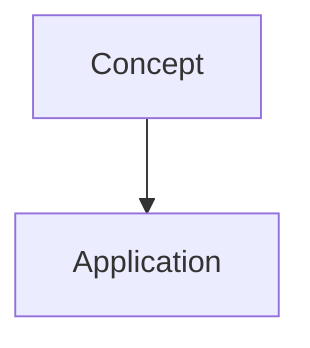

# [Topic]: A Complete Teaching Guide

## Learning Objectives
- Objective 1
- Objective 2
- Objective 3

## Prerequisites
What readers need to know before starting.

## Core Concept
### What is [Topic]?
Define it simply. Then build from there.

### Why It Matters
The real-world relevance. The problem it solves.

## Deep Dive
### [Subtopic 1]
Explain the concept. Include a concrete example. Add a diagram.

### [Subtopic 2]
Layer on complexity. Show how it connects to Subtopic 1.

### [Subtopic 3]
Edge cases, nuances, and advanced considerations.

## Practical Example
A worked-through example from start to finish.

## Visual Walkthrough
[Include chart, diagram, or infographic here]

## Key Takeaways
- Takeaway 1
- Takeaway 2
- Takeaway 3

## Practice Exercises
1. Exercise 1
2. Exercise 2
3. Exercise 3
